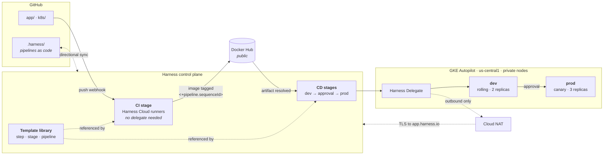

# Harness Implementation Engineering Lab

An end-to-end CI/CD implementation on [Harness](https://harness.io): source is built by
**Harness CI** on hosted runners, published to a public registry, and promoted by
**Harness CD** through an in-cluster delegate into **GKE Autopilot** — dev on a rolling
deploy, prod on a canary behind an approval gate, with the whole pipeline assembled from
**reusable templates**.

> **Status:** in progress. [`docs/LAB-NOTES.md`](docs/LAB-NOTES.md) is the build log — what
> was done, what broke, and how each failure was diagnosed.

---

## Architecture

**The split is the point.** CI needs no delegate because it runs on Harness-hosted
infrastructure. CD does, because it has to reach a Kubernetes API server that Harness
cannot address. The delegate is the outbound-only agent that closes that gap — nothing
inbound is ever opened to the cluster.

**Why a registry sits in the middle.** Kubernetes cannot run source code; it pulls images
from a registry. The build host is ephemeral and the cluster can't reach it, so the
registry is both a hard requirement and the seam that lets CI and CD run on entirely
different infrastructure and still compose.

## Template hierarchy

The brief calls templatization "one of the biggest value propositions of Harness," so
reuse is demonstrated at three altitudes rather than once:

| Tier | Template | Reuse |
|---|---|---|
| **Step** | `Maven Build & Test`, `Build & Push Image` | Runtime inputs for goals, repo, tag |
| **Stage** | `Deploy to Kubernetes` | Referenced **twice** — dev and prod — with environment and strategy as inputs |
| **Pipeline** | `Java Service CI/CD` | Onboarding another service becomes "reference and supply inputs" |

The claim this is built to support: **adding a third environment is a ~90-second template
reference**, not a copy-pasted stage.

## Repository layout

| Path | Contents |
|---|---|
| `app/` | Spring Boot service + `Dockerfile` — one endpoint returning version, build and pod identity |
| `k8s/` | Go-templated manifests, base `values.yaml`, per-environment overrides in `env/` |
| `.harness/` | Pipelines, templates, services and environments as code |
| `scripts/` | Cluster park/resume, manifest validation |
| `docs/LAB-NOTES.md` | The write-up: evidence, failures, diagnoses, references |

## Design decisions

- **Immutable tags.** Images are tagged `<+pipeline.sequenceId>`, never `latest`. CD
  resolves the same expression, which is what wires the stages together — and makes
  "what is running in prod" an exact answer and rollback a redeploy.
- **The app reports its own version.** Bumping it and re-running proves the CI→CD loop
  visually rather than by assertion. It also reports its pod name, which makes canary and
  stable pods distinguishable during a rollout.
- **Private nodes + Cloud NAT.** The hosting organization denies external IPs on VMs, so
  nodes have no egress by default. NAT was chosen over a policy exemption — the constraint
  pushed the design toward the more production-realistic answer.
- **Autopilot over Standard.** Adopted after repeated zone capacity stockouts. Removes the
  node-capacity failure mode rather than relocating it, and suits an intermittent lab.
- **Cluster provisioning stays out of the delivery pipeline.** Platform teams own cluster
  IaC; application teams own delivery. That split also avoids a Terraform step destroying
  the cluster hosting the delegate that runs it.

## Notable findings

Seven documented in [`docs/LAB-NOTES.md`](docs/LAB-NOTES.md), including: an inherited org
policy denying external IPs (which would have made the delegate install cleanly and never
connect); `--enable-private-nodes` silently enabling an *empty* control-plane allow-list;
a registry token with insufficient scopes caught by pre-checking rather than by a failed
pipeline; and a verification script that reported success over a failed push — twice, for
two different reasons.

## Working in this repo

Work is tracked in [GitHub issues](../../issues); `main` is protected and changes land via
pull request.

## Reproducing

No account identifiers, cluster endpoints, or credentials are committed. Substitute your
own for `<GCP_PROJECT_ID>` and `<REGISTRY_USER>`, copy `scripts/lab.env.example` to
`scripts/lab.env`, and supply credentials through the Harness secret manager.

## References

- [Harness CI — Java quickstart](https://developer.harness.io/tutorials/ci-pipelines/build/java)
- [Harness Cloud build infrastructure](https://developer.harness.io/docs/continuous-integration/use-ci/set-up-build-infrastructure/use-harness-cloud-build-infrastructure/)
- [Harness CD — Kubernetes manifest quickstart](https://developer.harness.io/tutorials/cd-pipelines/kubernetes/manifest)
- [Harness Templates](https://developer.harness.io/docs/category/templates)
