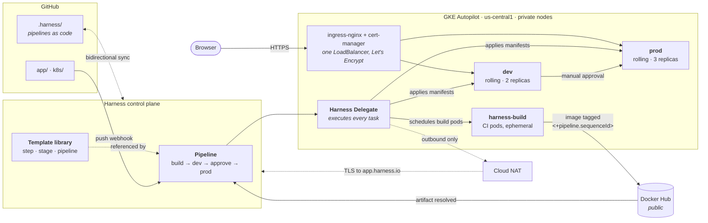

# Harness Implementation Engineering Lab

**I containerized a game I built for Vercel and redeployed it to GKE — rebuilding Vercel's
multi-stage deploy explicitly with Harness CI/CD, and templatizing it so the pipeline is
reusable rather than bespoke.**

The application is [Webo's Money World](https://github.com/wealthbot-io/webo-money-world),
a kids' financial-literacy game: a static frontend plus two Vercel serverless functions.
It runs on Vercel today. This repo runs the same source on Kubernetes.

That reframing is the interesting part. Vercel gives you a great deal *implicitly* — a CDN,
security headers from `vercel.json`, preview-to-production promotion, zero-downtime
rollouts, instant rollback. None of it survives the move to Kubernetes. Rebuilding it makes
every one of those an **explicit, inspectable piece of pipeline**:

| Vercel gives you implicitly | Rebuilt here as |
|---|---|
| Build on push | Harness CI, triggered by a GitHub webhook on `main` |
| Immutable deployment per commit | Image tagged `<+pipeline.sequenceId>` |
| Preview → Production promotion | `dev` → Harness approval gate → `prod` |
| Zero-downtime rollout | `K8sRollingDeploy` with `maxUnavailable: 0` |
| Automatic HTTPS on a real hostname | ingress-nginx + cert-manager + Let's Encrypt |
| Headers from `vercel.json` | Reapplied in the container server |
| Instant rollback | `K8sRollingRollback`, automatic on stage failure |
| Env vars in the dashboard | Harness secret manager → Kubernetes Secret |

Knowing what a platform does *for* you — and being able to rebuild it when a customer
cannot use that platform — is the job. The templates are what stop it from being a
one-off.

The handlers in `api/` are **not modified**: the same source still runs on Vercel. Only the
thing invoking them changed.

> **Status:** all five exercises complete, including the templatization bonus.
> [`docs/LAB-NOTES.md`](docs/LAB-NOTES.md) is the build log — what was done, what broke, and
> how each failure was diagnosed. The cluster is parked between sessions
> (`scripts/lab-down.sh`), so the public URLs serve only while it is resumed.

---

## Architecture



**Everything here runs through the delegate, and that was not the original plan.**

Harness offers two CI build infrastructures, and the distinction between them is the concept
worth holding onto:

- **Harness Cloud** — builds run on Harness-hosted runners. No delegate, nothing to operate.
- **Self-hosted (`KubernetesDirect`)** — builds run as pods in *your* cluster, scheduled by
  the delegate.

CD has no such choice. It must reach a Kubernetes API server that Harness cannot address, so
it always needs the delegate — the outbound-only agent that closes that gap without opening
anything inbound to the cluster.

This lab was designed for Harness Cloud, which would have made CI delegate-free. **Harness
Cloud requires credit-card validation, which a trial account does not have**, so CI moved to
`KubernetesDirect` in the `harness-build` namespace. Build pods are now scheduled by the same
delegate that performs the deployments, through a connector using delegate credentials.

Two things that follow, both more interesting than the original claim:

- **The step templates had to change.** On Harness Cloud a `Run` step executes directly on the
  host and needs no image. On Kubernetes every step is a pod, so `image` is mandatory — the
  first pipeline run failed at Initialize with `image is required`. The templates now take
  `image` and `connectorRef` as runtime inputs, so one template serves both infrastructures.
  See Finding 14.
- **The cluster is now a build dependency, not just a deploy target.** Parking it stops CI as
  well as CD, which is why `scripts/lab-down.sh` and the pipeline are more coupled than the
  original design intended.

The generalisable point for a customer conversation: *the free tier's billing gate changed the
architecture.* Worth knowing before recommending Harness Cloud to someone still evaluating.

**Why a registry sits in the middle.** Kubernetes cannot run source code; it pulls images
from a registry. The build host is ephemeral and the cluster can't reach it, so the
registry is both a hard requirement and the seam that lets CI and CD run on entirely
different infrastructure and still compose.

## Template hierarchy

The brief calls templatization "one of the biggest value propositions of Harness," so
reuse is demonstrated at three altitudes rather than once:

| Tier | Template (`v1`) | Reuse |
|---|---|---|
| **Step** | `build and test`, `build and push image` | Runtime inputs for image, connector, command, repo, Dockerfile |
| **Stage** | `deploy to kubernetes` | Referenced **twice** — dev and prod — with service, environment and infrastructure as inputs |
| **Pipeline** | `service cicd` | Onboarding another service becomes "reference and supply inputs" |

`webo_cicd.yaml` is a **pure reference** to the pipeline template plus its inputs — 60 lines
where the inlined equivalent was 105. Nothing about the delivery shape lives in the pipeline
itself.

What is an input and what is policy is a deliberate line. The image tag is **not** an input:

```yaml
tags: [<+pipeline.sequenceId>]   # policy, not an input
```

A team that can override the tag can ship `latest`, and the CI→CD seam depends on both stages
resolving the same expression. Templates are where that kind of rule is enforced once instead
of reviewed forever.

The claim this is built to support: **adding a third environment is a ~90-second template
reference**, not a copy-pasted stage.

## Repository layout

| Path | Contents |
|---|---|
| `app/` | The Vercel app plus `server.js` — a Node 22 shim reconstructing Vercel's runtime so `api/` handlers run unmodified — and `Dockerfile`. `/api/version` reports version, build and pod identity |
| `k8s/` | Go-templated manifests, base `values.yaml`, per-environment overrides in `env/`, Ingress with cert-manager annotations |
| `.harness/` | Pipeline, 4 templates, service, 2 environments, 2 infrastructure definitions, input set — as code |
| `scripts/` | Cluster park/resume, manifest validation |
| `docs/LAB-NOTES.md` | The write-up: evidence, failures, diagnoses, references |

## Design decisions

- **Immutable tags.** Images are tagged `<+pipeline.sequenceId>`, never `latest`. CD
  resolves the same expression, which is what wires the stages together — and makes
  "what is running in prod" an exact answer and rollback a redeploy.
- **The app reports its own version.** Bumping it and re-running proves the CI→CD loop
  visually rather than by assertion. It also reports its pod name, so a rollout is
  observable from outside the cluster rather than only through `kubectl`.
- **Rolling in both environments; canary was descoped.** The plan was canary in prod to
  contrast the two strategies. By the time the delivery path was complete — dev → approval →
  prod, environment-scoped overrides, automatic rollback, HTTPS, webhook trigger — canary
  would have demonstrated a *step type*, not a capability the pipeline lacked. The stage
  template takes the execution strategy as its shape, so switching prod to canary is an edit
  to one template rather than to the pipeline. Reasoned in issue #3.
- **Private nodes + Cloud NAT.** The hosting organization denies external IPs on VMs, so
  nodes have no egress by default. NAT was chosen over a policy exemption — the constraint
  pushed the design toward the more production-realistic answer.
- **Autopilot over Standard.** Adopted after repeated zone capacity stockouts. Removes the
  node-capacity failure mode rather than relocating it, and suits an intermittent lab.
- **Cluster provisioning stays out of the delivery pipeline.** Platform teams own cluster
  IaC; application teams own delivery. That split also avoids a Terraform step destroying
  the cluster hosting the delegate that runs it.

## Notable findings

Every failure and its diagnosis is recorded in [`docs/LAB-NOTES.md`](docs/LAB-NOTES.md) —
symptom, hypothesis, the check that confirmed or refuted it, fix. A sample:

- **An inherited org policy denying external IPs on VMs.** Would have let the delegate install
  cleanly and then never connect. Solved with Cloud NAT rather than a policy exemption.
- **Harness Cloud requires credit-card validation**, which a trial does not have — so CI moved
  to self-hosted Kubernetes build infrastructure, and the step templates had to grow an
  `image` input to work on both.
- **`runAsNonRoot` and `USER node` are individually correct and incompatible.** Kubernetes
  cannot verify a username is non-root without starting the container, so it rejects the pod
  outright. Numeric UID required.
- **Autopilot forbids writes to `kube-system`**, which breaks cert-manager's default leader
  election — a managed-platform restriction meeting a tool that assumes it can write anywhere.
- **A production CDN wildcard blocked the obvious DNS approach.** The workaround existed
  inside the constraint; removing the constraint would have caused a production incident to
  solve a lab problem.
- **Checks that lied — collected as a cross-cutting finding**, because they turned out to be
  the most transferable thing here. A `docker push` whose exit code came from `tail`; a
  `PIPESTATUS` guard written in bash and run in zsh; a `curl` that passed against Docker
  Desktop's listener instead of the server under test. The principle: *a check that cannot
  fail is worse than no check*, which in a CI/CD context is the whole product.

## Working in this repo

Work is tracked in [GitHub issues](../../issues); `main` is protected and changes land via
pull request.

## Reproducing

No account identifiers, cluster endpoints, or credentials are committed. Substitute your
own for `<GCP_PROJECT_ID>` and `<REGISTRY_USER>`, copy `scripts/lab.env.example` to
`scripts/lab.env`, and supply credentials through the Harness secret manager.

## References

- [Kubernetes cluster build infrastructure](https://developer.harness.io/docs/continuous-integration/use-ci/set-up-build-infrastructure/k8s-build-infrastructure/set-up-a-kubernetes-cluster-build-infrastructure/) — what CI actually runs on here
- [Harness Cloud build infrastructure](https://developer.harness.io/docs/continuous-integration/use-ci/set-up-build-infrastructure/use-harness-cloud-build-infrastructure/) — the hosted alternative, and the original plan
- [Harness CD — Kubernetes manifest quickstart](https://developer.harness.io/tutorials/cd-pipelines/kubernetes/manifest)
- [Harness Templates](https://developer.harness.io/docs/category/templates)
- [Harness Git Experience](https://developer.harness.io/docs/platform/git-experience/git-experience-overview/)
- [Delegate overview](https://developer.harness.io/docs/platform/delegates/delegate-concepts/delegate-overview/)
